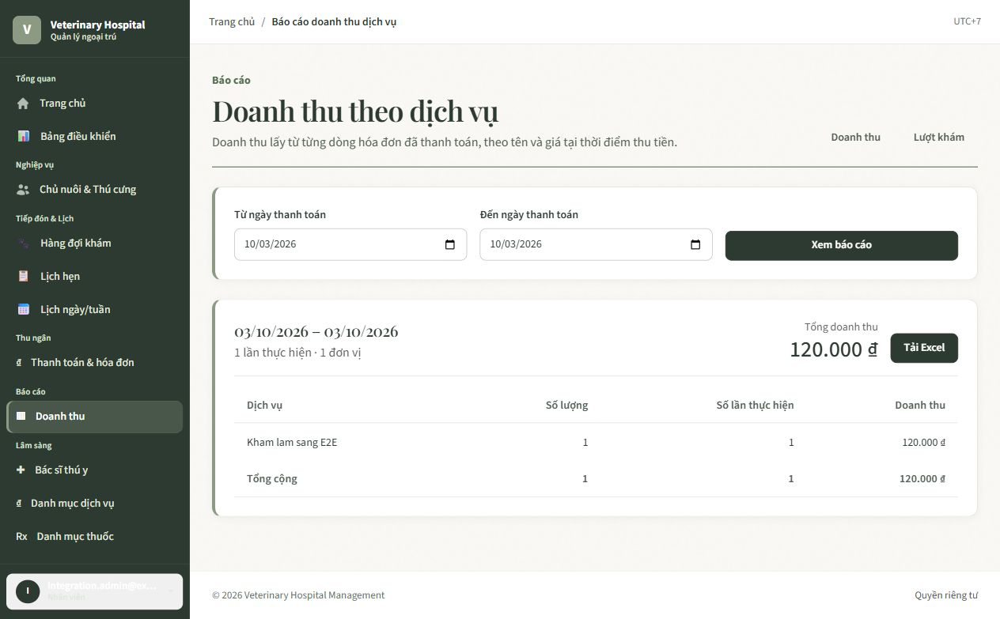
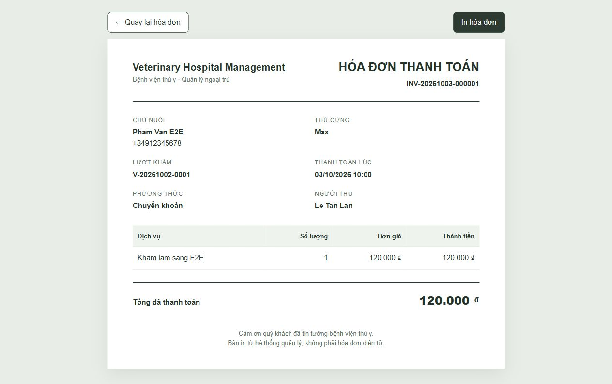
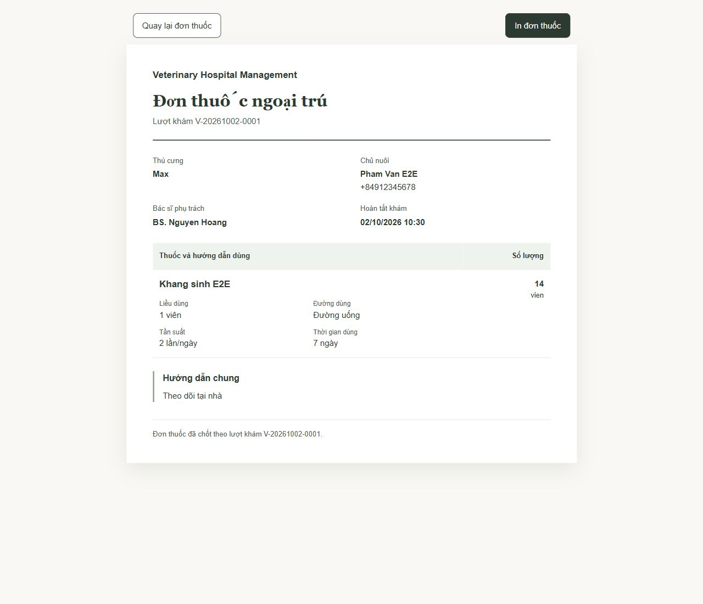

# Veterinary Hospital Management

Ứng dụng web quản lý bệnh viện thú y ngoại trú, xây dựng bằng ASP.NET Core MVC và SQL Server. Tài liệu này hướng dẫn cài trên máy Windows, kết nối database, chạy ứng dụng, tạo tài khoản Admin đầu tiên và đi thử một lượt khám.

## Mục lục

- [Tính năng](#tính-năng)
- [Công nghệ và yêu cầu](#công-nghệ-và-yêu-cầu)
- [Cài đặt và chạy lần đầu](#cài-đặt-và-chạy-lần-đầu)
- [Kết nối SQL Server và xem dữ liệu](#kết-nối-sql-server-và-xem-dữ-liệu)
- [Tạo tài khoản Admin đầu tiên](#tạo-tài-khoản-admin-đầu-tiên)
- [Tài khoản và dữ liệu demo](#tài-khoản-và-dữ-liệu-demo)
- [Hướng dẫn dùng hệ thống](#hướng-dẫn-dùng-hệ-thống)
- [Migration và thay đổi database](#migration-và-thay-đổi-database)
- [Build và kiểm thử](#build-và-kiểm-thử)
- [Cấu trúc project](#cấu-trúc-project)
- [Xử lý lỗi thường gặp](#xử-lý-lỗi-thường-gặp)
- [Tài liệu và giới hạn hiện tại](#tài-liệu-và-giới-hạn-hiện-tại)

## Tính năng

- Đăng nhập nội bộ bằng ASP.NET Core Identity; không có đăng ký công khai.
- Quản lý tài khoản nhân viên, bốn vai trò, ma trận quyền và nhật ký kiểm toán.
- Quản lý chủ nuôi, thú cưng, loài/giống; mã chủ nuôi, thú cưng và bác sĩ được tự sinh.
- Quản lý hồ sơ bác sĩ, ca làm, dịch vụ và danh mục thuốc.
- Đặt lịch, xem lịch ngày/tuần, kiểm tra thời gian bác sĩ, hủy lịch và ghi nhận khách không đến.
- Tiếp nhận lịch hẹn hoặc khách đến trực tiếp, phân công bác sĩ và theo dõi hàng đợi.
- Ghi bệnh án, dấu hiệu khám, đơn thuốc và dịch vụ thực hiện trong lượt khám.
- Hoàn tất lượt khám theo quy tắc nghiệp vụ; lưu snapshot để hồ sơ lịch sử không đổi theo danh mục hiện tại.
- Thanh toán tiền mặt/chuyển khoản, lập một hóa đơn cho mỗi lượt khám và in hóa đơn.
- In đơn thuốc A4 đã chốt, có liều dùng, đường dùng, tần suất, thời gian và lưu ý.
- Dashboard, báo cáo doanh thu/lượt khám/dịch vụ và xuất Excel.

## Một vài màn hình demo

Các ảnh dưới đây là ảnh chụp giao diện chạy local với dữ liệu kiểm thử mẫu. Thông tin chủ nuôi, thú cưng và hóa đơn trong ảnh là dữ liệu giả.

<p align="center">
  
  
</p>

<p align="center">
  
</p>

## Công nghệ và yêu cầu

- Windows 10/11.
- .NET SDK 10.
- SQL Server cài trên máy hoặc máy chủ mà máy phát triển có thể kết nối. Cấu hình mặc định dùng Windows Authentication và địa chỉ `localhost`.
- Visual Studio có workload **ASP.NET and web development**, hoặc PowerShell/Windows Terminal.
- SQL Server Management Studio (SSMS) để xem database và dữ liệu (không bắt buộc để chạy ứng dụng).

Kiểm tra .NET SDK đã cài:

```powershell
dotnet --list-sdks
```

Trong danh sách cần có SDK 10.x. Repository chứa local tool manifest cho `dotnet-ef`; khôi phục tool trước khi chạy lệnh migration.

## Cài đặt và chạy lần đầu

Mở PowerShell tại thư mục repository:

```powershell
cd 'D:\vu\hoctap\webC#\VeterinaryHospitalManagement'
```

Khôi phục package và EF tool:

```powershell
dotnet restore VeterinaryHospitalManagement.slnx
dotnet tool restore
```

Kiểm tra SQL Server đang chạy và tài khoản Windows hiện tại có quyền tạo database. Connection string Development mặc định nằm ở `src/VeterinaryHospitalManagement.Web/appsettings.Development.json`:

```text
Server=localhost;Database=VeterinaryHospitalManagementDb;Integrated Security=True;Encrypt=True;TrustServerCertificate=True;MultipleActiveResultSets=False
```

Nếu SQL Server của bạn ở một instance khác, sửa `Server` trong connection string, ví dụ `localhost\SQLEXPRESS`. Không đưa mật khẩu thật vào file được commit; với SQL Authentication hãy dùng user-secrets hoặc biến môi trường phù hợp.

Áp dụng toàn bộ migration vào đúng database đã cấu hình:

```powershell
dotnet ef database update --project src/VeterinaryHospitalManagement.Web --startup-project src/VeterinaryHospitalManagement.Web
```

Chạy ứng dụng bằng HTTPS:

```powershell
dotnet run --project src/VeterinaryHospitalManagement.Web --launch-profile https
```

Mở `https://localhost:7164/Account/Login`. Profile HTTP dùng `http://localhost:5133`; cookie đăng nhập được cấu hình chỉ gửi qua HTTPS, vì vậy hãy dùng địa chỉ HTTPS khi đăng nhập. Lần đầu, trình duyệt có thể hỏi tin cậy chứng chỉ phát triển ASP.NET Core.

Có thể mở `VeterinaryHospitalManagement.slnx` bằng Visual Studio, đặt `VeterinaryHospitalManagement.Web` làm Startup Project, rồi nhấn **F5**. Các link nghiệp vụ xuất hiện sau khi đăng nhập và phụ thuộc vào quyền của tài khoản; trang `/` là landing page giới thiệu hệ thống.

## Kết nối SQL Server và xem dữ liệu

Sau khi lệnh `dotnet ef database update` chạy thành công:

1. Mở SSMS và chọn **Connect → Database Engine**.
2. Nhập **Server name** là `localhost` (hoặc đúng instance đang dùng), **Authentication** là `Windows Authentication`, rồi chọn **Connect**.
3. Trong Object Explorer, nhấn phải **Databases → Refresh**. Mở `VeterinaryHospitalManagementDb` → **Tables** để xem các bảng.
4. Muốn xem dữ liệu, nhấn phải một bảng → **Select Top 1000 Rows**. Bảng tài khoản Identity bắt đầu bằng `AspNet...`; bảng nghiệp vụ có tên như `Owners`, `Pets`, `Appointments`, `Visits`, `MedicalRecords`, `Prescriptions` và `Invoices`.

Sơ đồ quan hệ hiện tại nằm trong [docs/DatabaseSchema_Current.md](docs/DatabaseSchema_Current.md). Đây là sơ đồ Mermaid theo EF model; mở Markdown Preview trong Visual Studio Code hoặc xem trên GitHub để đọc quan hệ. SQL Server/SSMS không tự hiển thị sơ đồ chỉ vì migration đã chạy. Nếu muốn tạo sơ đồ trong SSMS, dùng **Database Diagrams → New Database Diagram** sau khi database có bảng; lần đầu SQL Server có thể yêu cầu cài các đối tượng hỗ trợ diagram. Sơ đồ trong tài liệu là nguồn đọc nhanh, còn migration và EF model trong code là nguồn schema của ứng dụng.

> Trước khi chạy migration, kiểm tra server và database trong connection string. `database update` áp schema lên đúng database đó. Đừng nhầm database ứng dụng `VeterinaryHospitalManagementDb` với database test `VeterinaryHospitalManagement_Test`.

## Tạo tài khoản Admin đầu tiên

Ứng dụng không tự tạo Admin và không áp migration khi khởi động. Sau khi đã chạy `database update`, cấu hình thông tin bootstrap an toàn bằng .NET user-secrets:

```powershell
dotnet user-secrets set "BootstrapAdmin:Email" "admin@example.com" --project src/VeterinaryHospitalManagement.Web
dotnet user-secrets set "BootstrapAdmin:Password" "THAY_BANG_MAT_KHAU_MANH" --project src/VeterinaryHospitalManagement.Web
dotnet user-secrets set "BootstrapAdmin:FullName" "Quản trị hệ thống" --project src/VeterinaryHospitalManagement.Web
dotnet user-secrets set "BootstrapAdmin:Enabled" "true" --project src/VeterinaryHospitalManagement.Web
dotnet user-secrets set "IdentitySeed:RunOnStartup" "true" --project src/VeterinaryHospitalManagement.Web
dotnet run --project src/VeterinaryHospitalManagement.Web --launch-profile https
```

Seed tạo bốn role hệ thống (`Admin`, `Manager`, `Receptionist`, `Veterinarian`), catalog permission và Admin đầu tiên bằng Identity. Nếu cấu hình thiếu hoặc email đang thuộc một tài khoản không phải Admin, ứng dụng dừng và báo lỗi mà không tự nâng quyền tài khoản đó.

Sau khi đăng nhập thành công, dừng ứng dụng. Tắt seed và xóa bí mật bootstrap:

```powershell
dotnet user-secrets set "BootstrapAdmin:Enabled" "false" --project src/VeterinaryHospitalManagement.Web
dotnet user-secrets set "IdentitySeed:RunOnStartup" "false" --project src/VeterinaryHospitalManagement.Web
dotnet user-secrets remove "BootstrapAdmin:Email" --project src/VeterinaryHospitalManagement.Web
dotnet user-secrets remove "BootstrapAdmin:Password" --project src/VeterinaryHospitalManagement.Web
dotnet user-secrets remove "BootstrapAdmin:FullName" --project src/VeterinaryHospitalManagement.Web
```

Sau đó chạy lại app bình thường và đăng nhập tại `/Account/Login`. Admin quản lý nhân viên tại **Quản lý tài khoản**, chỉnh quyền tại **Ma trận quyền**. Một tài khoản có role Veterinarian sẽ có hồ sơ bác sĩ và mã bác sĩ được tạo đồng bộ.

## Tài khoản và dữ liệu demo

Chỉ dùng dữ liệu dưới đây trên database Development để học hoặc thử giao diện. Không dùng tài khoản demo làm tài khoản thật.

| Vai trò | Email | Mật khẩu seed ban đầu |
| --- | --- | --- |
| Lễ tân | `receptionist@hospital.local` | `Receptionist123!` |
| Bác sĩ | `doctor.tam@hospital.local` | `Doctor123!` |
| Quản lý | `manager@hospital.local` | `Manager123!` |

Sau khi tạo Admin, mở PowerShell tại repository và chạy seed mẫu:

```powershell
$env:ASPNETCORE_ENVIRONMENT = "Development"
dotnet run --project src/VeterinaryHospitalManagement.Web --no-launch-profile -- --seed-demo-only
```

Lệnh này chỉ chạy trong Development, bổ sung dữ liệu còn thiếu rồi thoát. Nó tạo tài khoản nhân viên mẫu, Chó/Mèo và giống Poodle/Mèo ta, hai dịch vụ, một thuốc, hai chủ nuôi và thú cưng. Nếu có thể tạo ca bác sĩ và lịch của Milu vào khung giờ 09:00–09:30 trong **ngày chạy seed theo giờ Việt Nam**, seed cũng tạo chúng. Seed không tự check-in, khám hoặc thanh toán.

Seed giữ nguyên tài khoản và hồ sơ đã có. Nếu số điện thoại mẫu đã thuộc một chủ nuôi khác, seed bỏ qua hồ sơ mẫu đó. Nếu cùng ngày ca/lịch trùng với dữ liệu hiện có, nghiệp vụ có thể từ chối tạo lịch. Chạy lại seed không sửa dữ liệu kinh doanh hiện có; chạy vào ngày khác có thể tạo ca/lịch mới cho ngày đó.

Nếu có tài khoản Veterinarian cũ nhưng thiếu hồ sơ bác sĩ, có thể đồng bộ phần còn thiếu trong Development:

```powershell
$env:ASPNETCORE_ENVIRONMENT = "Development"
dotnet run --project src/VeterinaryHospitalManagement.Web --no-launch-profile -- --sync-veterinarians-only
```

Lệnh này có thể chạy lại, không cần migration, và tự thoát sau khi hoàn tất.

## Hướng dẫn dùng hệ thống

Navigation hiển thị theo role và permission. Quyền mặc định được cấp khi seed lần đầu; Admin có thể thay đổi ma trận. Các quyền nhạy cảm quản lý tài khoản, phân quyền và audit chỉ dành cho Admin. Bác sĩ chỉ xem/chỉnh hồ sơ lâm sàng thuộc lượt khám được giao; lễ tân xử lý tiếp nhận và thanh toán; quản lý xem danh mục/lịch và báo cáo theo quyền.

### Chạy thử một lượt khám

1. Đăng nhập bằng Admin, vào **Quản lý tài khoản** và xác nhận các nhân viên cần dùng đã được tạo. Nếu dùng demo, đăng nhập lễ tân mẫu.
2. Vào **Chủ nuôi & Thú cưng**, tìm chủ nuôi theo điện thoại hoặc mã. Tạo chủ nuôi/thú cưng mới nếu cần; hệ thống tự sinh mã hồ sơ.
3. Vào **Lịch hẹn**, chọn thú cưng, bác sĩ và khung giờ còn trống. Có thể dùng lịch mẫu của Milu nếu seed đã tạo lịch hôm nay.
4. Lễ tân mở hàng đợi, tiếp nhận lịch hẹn (hoặc chọn tiếp nhận khách trực tiếp), rồi phân công bác sĩ nếu cần.
5. Bác sĩ mở lượt được giao và bắt đầu khám. Ghi bệnh án có chẩn đoán; thêm dịch vụ, rồi đánh dấu từng dòng đã thực hiện hoặc đã hủy. Có thể tạo đơn thuốc nếu cần.
6. Bác sĩ hoàn tất lượt khám sau khi không còn dịch vụ chờ xử lý và dữ liệu bệnh án/đơn thuốc hợp lệ.
7. Lễ tân mở **Thanh toán & hóa đơn**, kiểm tra các dịch vụ đã thực hiện, chọn tiền mặt hoặc chuyển khoản và xác nhận thanh toán. Dịch vụ bị hủy và thuốc không tự cộng vào tổng hóa đơn.
8. Mở hóa đơn để xem hoặc in. Người có quyền `Invoice.Print` mới mở được bản in.
9. Vào **Báo cáo** để xem doanh thu, lượt khám, dịch vụ hoặc tải Excel theo khoảng ngày. Doanh thu tính theo ngày thanh toán; lượt khám dùng ngày tiếp nhận, theo giờ Việt Nam.

### Đơn thuốc và hóa đơn

Đơn thuốc chỉ in sau khi bác sĩ hoàn tất lượt khám và chốt đơn. Từ chi tiết đơn thuốc, chọn **In đơn thuốc**. Admin hoặc bác sĩ đang hoạt động phụ trách lượt khám cần có cả `Prescription.View` và `Prescription.Print`. Trang in sử dụng snapshot tên/đơn vị thuốc và thông tin đã lưu; in từ trình duyệt theo khổ A4. Chưa nghiệm thu máy in vật lý.

Hóa đơn được tính lại phía server khi xác nhận thanh toán, tối đa một hóa đơn cho mỗi lượt khám. Bản in hóa đơn hỗ trợ trình duyệt/A4 nhưng không phải hóa đơn điện tử có kết nối cơ quan thuế.

## Migration và thay đổi database

Các migration EF Core là nguồn duy nhất để thay đổi schema. Repository hiện có 11 migration; migration mới nhất là `20260926181724_AddInvoices`. Lệnh `database update` có thể chạy lại: EF chỉ áp dụng migration chưa có trong `__EFMigrationsHistory`.

Áp tất cả migration vào database trong connection string:

```powershell
dotnet tool restore
dotnet ef database update --project src/VeterinaryHospitalManagement.Web --startup-project src/VeterinaryHospitalManagement.Web
```

Kiểm tra trạng thái migration:

```powershell
dotnet ef migrations list --project src/VeterinaryHospitalManagement.Web --startup-project src/VeterinaryHospitalManagement.Web
```

Chỉ khi sửa entity/configuration làm đổi schema, tạo migration mới rồi review file migration trước khi cập nhật database:

```powershell
dotnet ef migrations add TenThayDoiNgan --project src/VeterinaryHospitalManagement.Web --startup-project src/VeterinaryHospitalManagement.Web
dotnet ef database update --project src/VeterinaryHospitalManagement.Web --startup-project src/VeterinaryHospitalManagement.Web
```

Nếu chỉ sửa controller, service, view hoặc CSS thì thường không cần migration. Không sửa bảng trực tiếp trong SSMS để thay schema ứng dụng. Trước khi áp vào database đang có dữ liệu, xác nhận đúng server/database và sao lưu theo quy trình của bạn.

## Build và kiểm thử

Build solution:

```powershell
dotnet restore VeterinaryHospitalManagement.slnx
dotnet build VeterinaryHospitalManagement.slnx --no-restore
```

Chạy test mặc định:

```powershell
dotnet test VeterinaryHospitalManagement.slnx --no-build
```

Các bài test SQL Server được bỏ qua trong lượt mặc định nếu chưa bật opt-in. Một số fixture SQL có thể xóa và tạo lại database test riêng; chỉ chạy chúng khi đã hiểu phạm vi database và đúng biến môi trường xác nhận trong test. Connection contract được khóa vào `localhost/VeterinaryHospitalManagement_Test`; tuyệt đối không đổi test connection sang database ứng dụng.

Kết quả kiểm tra gần nhất và phạm vi chưa kiểm chứng được ghi trong [docs/M11_Acceptance.md](docs/M11_Acceptance.md). Tại lần cập nhật tài liệu này, test mặc định đạt **218 passed, 0 failed, 122 skipped**; 122 test SQL bị bỏ qua theo thiết kế. Các lượt SQL tập trung gần đây được chạy riêng trên database test và được ghi trong báo cáo nghiệm thu. Không suy ra test SQL đã chạy chỉ từ kết quả mặc định.

## Cấu trúc project

```text
VeterinaryHospitalManagement/
├── src/
│   └── VeterinaryHospitalManagement.Web/
│       ├── Areas/BackOffice/       # Controller, ViewModel, Razor View nội bộ
│       ├── Authorization/          # Catalog và policy permission
│       ├── Data/                   # DbContext, entity configuration, seed
│       ├── Migrations/             # EF Core migrations
│       ├── Models/                 # Entity và enum
│       └── Services/               # Nghiệp vụ theo module
├── tests/
│   └── VeterinaryHospitalManagement.Tests/
├── docs/
│   ├── VeterinaryHospitalManagement_ProjectPlan_v1.0.md
│   ├── DatabaseDesign_v1.0.md
│   ├── DatabaseSchema_Current.md
│   ├── M11_Acceptance.md
│   └── Codex_Continuation_Prompt.md
└── VeterinaryHospitalManagement.slnx
```

Ứng dụng theo kiến trúc MVC → service → một `ApplicationDbContext`, dùng SQL Server và EF Core. Identity cung cấp đăng nhập; các policy permission kiểm soát từng thao tác. Thời gian nghiệp vụ hiển thị theo múi giờ Việt Nam. Không có API/SPA riêng.

## Xử lý lỗi thường gặp

### `dotnet-ef does not exist` hoặc không tìm thấy `dotnet ef`

Đứng tại thư mục gốc repository và chạy:

```powershell
dotnet tool restore
```

Sau đó chạy lại nguyên lệnh EF có cả `--project` và `--startup-project` như mục Migration.

### `A network-related or instance-specific error` khi kết nối database

Kiểm tra service SQL Server đang chạy, đúng Server name/instance và tài khoản Windows hiện tại có quyền. Nếu dùng SQL Express, thử `localhost\SQLEXPRESS`; cập nhật `DefaultConnection` trong `appsettings.Development.json` trước khi chạy migration/app.

### `Invalid object name 'TênBảng'`

Ứng dụng đang đọc bảng chưa có trong database mà connection string hiện tại trỏ tới. Dừng app, xác nhận đúng database, chạy `dotnet ef database update ...` từ thư mục repository, rồi khởi động lại. Nếu migration báo không tìm thấy command, chạy `dotnet tool restore` trước.

### Ứng dụng chỉ hiện landing page

Trang `/` là trang giới thiệu. Đăng nhập tại `https://localhost:7164/Account/Login`; các màn nghiệp vụ nằm trong BackOffice và chỉ hiện khi tài khoản có quyền tương ứng. Database mới cần migration và tài khoản Admin bootstrap trước. Tài khoản demo chỉ có sau khi chạy `--seed-demo-only`.

### SSMS không thấy database sau khi migration thành công

Trong SSMS kiểm tra bạn đang kết nối đúng server/instance mà connection string dùng. Nhấn phải **Databases → Refresh**. Ứng dụng có thể đang kết nối một SQL Server instance khác nếu `Server` không phải `localhost`.

### Đăng nhập được nhưng không thấy chức năng

Navigation được lọc theo role và ma trận quyền. Đăng nhập Admin để kiểm tra **Quản lý tài khoản** và **Ma trận quyền**; xác nhận user hoạt động, role đúng và các permission cần thiết đã cấp. User Veterinarian cần hồ sơ bác sĩ hoạt động và chỉ truy cập lượt khám được phân công.

## Tài liệu và giới hạn hiện tại

- [Kế hoạch nghiệp vụ M1–M11](docs/VeterinaryHospitalManagement_ProjectPlan_v1.0.md)
- [Thiết kế database ban đầu](docs/DatabaseDesign_v1.0.md)
- [ERD/schema theo EF model hiện tại](docs/DatabaseSchema_Current.md)
- [Kết quả nghiệm thu và giới hạn kiểm chứng](docs/M11_Acceptance.md)
- [Prompt bàn giao cho task Codex tiếp theo](docs/Codex_Continuation_Prompt.md)

Plan ngoại trú M1–M11 đã được triển khai và nghiệm thu local trên SQL Server; in đơn thuốc được bổ sung sau nghiệm thu ban đầu. Đây chưa phải nghiệm thu production. Chưa xác minh cài đặt trên máy sạch, triển khai server, sao lưu/khôi phục thực tế, tải lớn, Excel desktop hoặc máy in vật lý. Bản in hóa đơn không thay thế hóa đơn điện tử thuế.
