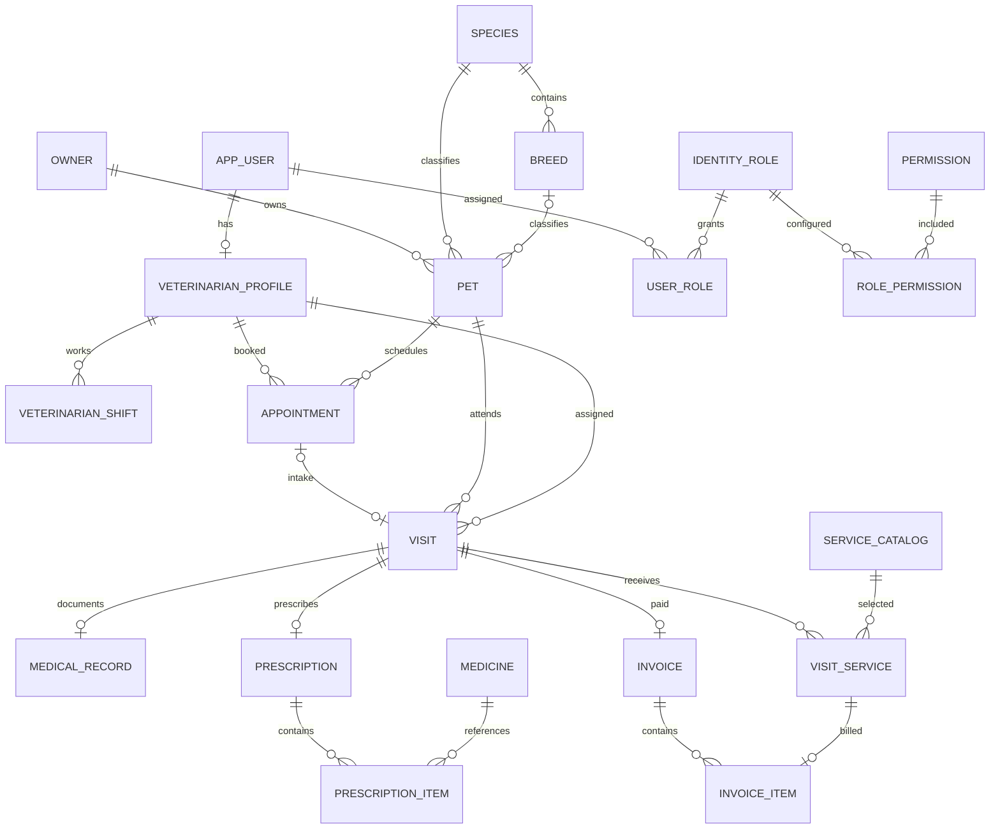

# Veterinary Hospital Management — Database Design v1.0

Ngày 14/09/2026. Bản schema đề xuất cho phạm vi ngoại trú trong ProjectPlan v1.0; chưa phải migration hoặc database đã triển khai.

## 1. Kết nối và nguồn schema

- SQL Server có sẵn: `localhost` hoặc `LAPTOP-31465OCJ`, default instance.
- Authentication đã kiểm tra: Windows Integrated Security.
- Database ứng dụng dự kiến: `VeterinaryHospitalManagementDb`.
- Database test dự kiến: `VeterinaryHospitalManagement_Test`.
- Chưa kiểm tra hai tên này đã tồn tại hay chưa; kiểm tra trước khi tạo, không tự xóa/ghi đè database có sẵn.
- Dùng EF Core Code First. Chốt ERD tổng thể trước, thêm entity/migration theo từng module.

Cấu hình local dự kiến trong `ConnectionStrings:DefaultConnection`:

```json
{
  "ConnectionStrings": {
    "DefaultConnection": "Server=localhost;Database=VeterinaryHospitalManagementDb;Integrated Security=True;Encrypt=True;TrustServerCertificate=True;MultipleActiveResultSets=False"
  }
}
```

`TrustServerCertificate=True` chỉ dành cho môi trường local này; khi triển khai cần cấu hình chứng chỉ theo môi trường thực tế. Chuỗi trên không chứa mật khẩu. Không đổi sang SQL login nếu chưa có nhu cầu.

## 2. Quy ước

- PK nghiệp vụ: `int IDENTITY`; AuditLog: `bigint IDENTITY`.
- Identity UserId/RoleId: `nvarchar(450)` theo Identity mặc định; các bảng Identity do EF Identity tạo.
- Mọi FK có cấu hình quan hệ; mặc định Restrict/NoAction cho dữ liệu lịch sử.
- Thời điểm: C# DateTimeOffset / SQL `datetimeoffset(7)`, chuẩn hóa UTC khi ghi; hiển thị giờ Việt Nam qua một TimeProvider/clock chung.
- Ngày sinh thú cưng: DateOnly / `date`, nullable khi không biết chính xác. Không lưu tuổi cố định.
- Tiền: decimal / `decimal(18,2)`, đơn giá nguyên VND; không float/double.
- Quantity dịch vụ/thuốc: `decimal(10,2)` > 0. Tổng dòng làm tròn nguyên VND bằng MidpointRounding.AwayFromZero; tổng hóa đơn = tổng các dòng đã làm tròn.
- Status: enum C# lưu `nvarchar(20)`, CHECK tập giá trị. `RowVersion` = SQL `rowversion` ở entity có cập nhật cạnh tranh, không phải ngày giờ.
- Chuỗi người dùng: `nvarchar`, chiều dài cụ thể. Trường nullable ghi dấu `?` bên dưới; còn lại NOT NULL, trừ các trường Identity theo framework.

## 3. Bảng và trường

### 3.1 Identity và RBAC

| Bảng | Trường bổ sung/chính |
| --- | --- |
| AspNetUsers | Identity mặc định + FullName nvarchar(150), IsActive bit, CreatedAt datetimeoffset |
| AspNetRoles và các bảng Identity phụ | Identity mặc định; seed Receptionist, Veterinarian, Manager, Admin |
| Permissions | Id int PK, Code nvarchar(100), Name nvarchar(150) |
| RolePermissions | RoleId nvarchar(450) FK AspNetRoles, PermissionId int FK Permissions; PK ghép |
| VeterinarianProfiles | Id int PK, UserId nvarchar(450) FK AspNetUsers, DoctorCode nvarchar(30), Specialty nvarchar(150)?, IsActive bit, RowVersion |
| AuditLogs | Id bigint PK, ActorType nvarchar(20), UserId nvarchar(450)? FK, Action nvarchar(100), EntityName nvarchar(100), EntityId nvarchar(100), Description nvarchar(2000), CreatedAt datetimeoffset |

RolePermission không phải hệ Role mới. Mỗi User có đúng một role, bảo vệ bằng service và unique index UserId trên AspNetUserRoles nếu duyệt mô hình này. Profile bác sĩ chỉ liên kết tài khoản nội bộ; tài khoản có profile bị khóa không được nhận lịch/khám mới.

Audit không chứa mật khẩu hoặc sao chép toàn bộ nội dung bệnh án. ActorType = Internal/System; các nghiệp vụ hiện tại đều do tài khoản nội bộ.

### 3.2 Chủ nuôi và thú cưng

| Bảng | Trường |
| --- | --- |
| Owners | Id, OwnerCode nvarchar(10), FullName nvarchar(150), PhoneNumber nvarchar(20), Email nvarchar(254)?, Address nvarchar(500)?, IsActive bit, CreatedAt, RowVersion |
| Species | Id, Code nvarchar(30), Name nvarchar(100), IsActive bit |
| Breeds | Id, SpeciesId FK, Name nvarchar(100), IsActive bit |
| Pets | Id, PetCode nvarchar(10), OwnerId FK, Name nvarchar(100), SpeciesId FK, BreedId FK?, Sex nvarchar(20), BirthDate date?, Color nvarchar(100)?, Notes nvarchar(1000)?, IsActive bit, CreatedAt, RowVersion |

Sex = Unknown/Male/Female. **DEC-01 đã chốt:** `PhoneNumber` chỉ nhận số di động Việt Nam. Sau khi trim khoảng trắng ngoài, input phải ở một trong ba dạng: `0` + 9 chữ số, `84` + 9 chữ số hoặc `+84` + 9 chữ số; chữ số đầu của phần 9 chữ số phải thuộc `3/5/7/8/9`. Chỉ nhận chữ số ASCII. Trong số có thể dùng space, dấu gạch ngang (`-`) hoặc dấu chấm (`.`) làm separator giữa các nhóm chữ số; không nhận separator ở đầu/cuối, separator liên tiếp, dấu ngoặc, extension hoặc ký tự khác. Canonical lưu database là `+84` + 9 chữ số, không separator, ví dụ `0912 345 678`, `84-912-345-678` và `+84.912.345.678` cùng lưu thành `+84912345678`. Nhiều Owner được phép dùng chung một canonical phone; tìm kiếm exact phải chuẩn hóa input bằng cùng quy tắc và trả danh sách tất cả Owner khớp để người dùng chọn, không tự lấy một bản ghi duy nhất. Không dùng số điện thoại để xác thực quyền xem hồ sơ.

`OwnerCode` và `PetCode` do hệ thống tự sinh theo đúng dạng `OWN-000001` và `PET-000001`. Dùng hai SQL sequence độc lập, bắt đầu từ 1, tăng 1, tối đa 999999 và không cycle; sequence bảo đảm cấp số an toàn khi tạo đồng thời. Số đã cấp không rollback nên được phép có khoảng trống khi transaction thất bại; không tái sử dụng số. Mỗi code có unique index và không được sửa sau khi tạo.

`Species.Code` chưa tự sinh trong lát này; quản trị viên sẽ nhập ở workflow danh mục sau. Khi workflow đó được triển khai, code được trim, chuyển uppercase invariant, giới hạn 30 ký tự và unique; không áp regex ngoài các quy tắc này. `Species.Name` không unique. Owner inactive không được chọn để tạo Pet mới; việc khóa Owner không cascade thay đổi `Pet.IsActive`, và các Pet đã có vẫn giữ quan hệ/lịch sử. Species và Breed giữ đúng các trường trong bảng trên, không thêm `CreatedAt` hoặc `RowVersion` trong migration này.

Breed phải thuộc đúng Species. Có thể dùng FK ghép `(BreedId, SpeciesId)` tới alternate key `(Id, SpeciesId)` của Breeds để bảo vệ ở DB; khi BreedId null vẫn giữ FK SpeciesId.

### 3.3 Lịch bác sĩ và lịch hẹn

| Bảng | Trường |
| --- | --- |
| VeterinarianShifts | Id, VeterinarianId FK, StartAt, EndAt, IsActive bit, RowVersion |
| Appointments | Id, AppointmentNumber nvarchar(30), PetId FK, VeterinarianId FK, StartAt, EndAt, Reason nvarchar(500), Status nvarchar(20), CancellationReason nvarchar(500)?, CreatedByUserId FK, CreatedAt, RowVersion |

Appointment.Status = Scheduled/CheckedIn/Cancelled/NoShow. Ca làm việc là khoảng cụ thể theo ngày, không bảng ca lặp tự động trong bản đầu. Ca của cùng bác sĩ không chồng nhau. Appointment phải nằm hoàn toàn trong một ca active.

Overlap dùng `a.StartAt < b.EndAt && b.StartAt < a.EndAt`. Chặn trùng Appointment Scheduled cùng bác sĩ hoặc cùng Pet. Appointment CheckedIn chưa qua EndAt vẫn giữ khoảng hẹn ban đầu khi kiểm tra lịch, trừ khi Visit đã Completed/Cancelled; không tạo khoảng giữ lịch vô hạn khi khám kéo dài.

Lịch hẹn tương lai là kế hoạch; thực tế bác sĩ bận được kiểm tra riêng lúc Start Visit. Không cho bắt đầu hai lượt khám cùng bác sĩ. Không sao chép luật check-in sớm/grace period của Music Box.

Khóa/sửa ca hoặc khóa bác sĩ phải từ chối khi làm mất hiệu lực lịch Scheduled tương lai; yêu cầu xử lý các lịch đó trước. Thay đổi đồng thời phải dùng cùng transaction strategy với tạo lịch.

### 3.4 Lượt khám và hồ sơ lâm sàng

| Bảng | Trường |
| --- | --- |
| Visits | Id, VisitNumber nvarchar(30), AppointmentId FK?, PetId FK, VeterinarianId FK, OwnerNameSnapshot nvarchar(150), OwnerPhoneSnapshot nvarchar(20), PetNameSnapshot nvarchar(100), VeterinarianNameSnapshot nvarchar(150), Status nvarchar(20), CheckedInAt, StartedAt?, CompletedAt?, CancellationReason nvarchar(500)?, CreatedByUserId FK, RowVersion |
| MedicalRecords | Id, VisitId FK, ChiefComplaint nvarchar(2000), Symptoms nvarchar(max)?, WeightKg decimal(6,2)?, TemperatureC decimal(4,1)?, Diagnosis nvarchar(max)?, TreatmentNotes nvarchar(max)?, FollowUpDate date?, Status nvarchar(20), FinalizedByVeterinarianId FK?, FinalizedAt?, RowVersion |
| Prescriptions | Id, VisitId FK, Instructions nvarchar(2000)?, Status nvarchar(20), CreatedAt, FinalizedAt?, RowVersion |
| PrescriptionItems | Id, PrescriptionId FK, MedicineId FK, MedicineNameSnapshot nvarchar(150), UnitSnapshot nvarchar(50), Dosage nvarchar(200), Route nvarchar(100), Frequency nvarchar(200), Duration nvarchar(200), Quantity decimal(10,2), Instructions nvarchar(1000)? |

Visit.Status = Waiting/InProgress/Completed/Cancelled. MedicalRecord/Prescription.Status = Draft/Finalized. Một Visit có tối đa một bệnh án và một đơn; đơn optional. Mỗi đơn đã chốt có ít nhất một dòng thuốc. Không áp unique (PrescriptionId, MedicineId): cùng thuốc có thể có các chỉ định khác nhau do bác sĩ nhập.

Visit nguồn Appointment phải cùng Pet/bác sĩ khi tiếp nhận. Có thể phân công lại bác sĩ khi Visit Waiting; khi đó Appointment lưu bác sĩ ban đầu, Visit lưu người phụ trách thực tế và cập nhật snapshot người này trong transaction + Audit. Chưa hỗ trợ chuyển bác sĩ khi đã InProgress.

Completed Visit có bệnh án Finalized; đơn nếu có cũng Finalized. Quan hệ này cần service transaction và test, FK đơn lẻ không bảo đảm được. Waiting Cancelled không được có bệnh án hoặc dịch vụ thực hiện; kết quả tiếp nhận của Appointment giữ CheckedIn để bảo toàn lịch sử, chi tiết Visit giải thích việc hủy.

### 3.5 Danh mục và dịch vụ

| Bảng | Trường |
| --- | --- |
| Medicines | Id, Code nvarchar(30), Name nvarchar(150), ActiveIngredient nvarchar(200)?, Strength nvarchar(100)?, Unit nvarchar(50), IsActive bit, RowVersion |
| ServiceCatalogs | Id, Code nvarchar(30), Name nvarchar(150), Category nvarchar(100), Price decimal(18,2), Description nvarchar(1000)?, IsActive bit, RowVersion |
| VisitServices | Id, VisitId FK, ServiceCatalogId FK, ServiceNameSnapshot nvarchar(150), Quantity decimal(10,2), UnitPrice decimal(18,2), Status nvarchar(20), PerformedAt?, PerformedByVeterinarianId FK?, CancellationReason nvarchar(500)?, CreatedAt, RowVersion |

VisitService.Status = Pending/Performed/Cancelled. Snapshot lấy từ danh mục khi tạo; thay giá danh mục không sửa dòng cũ. Không có giá bán hoặc số tồn trong Medicines vì chưa có workflow bán/cấp phát thuốc.

### 3.6 Hóa đơn

| Bảng | Trường |
| --- | --- |
| Invoices | Id, InvoiceNumber nvarchar(30), VisitId FK, OwnerNameSnapshot nvarchar(150), OwnerPhoneSnapshot nvarchar(20), PetNameSnapshot nvarchar(100), TotalAmount decimal(18,2), PaymentMethod nvarchar(20), PaidAt, ProcessedByUserId FK, ProcessedByNameSnapshot nvarchar(150) |
| InvoiceItems | Id, InvoiceId FK, VisitServiceId FK, DescriptionSnapshot nvarchar(150), Quantity decimal(10,2), UnitPrice decimal(18,2), LineTotal decimal(18,2) |

PaymentMethod = Cash/BankTransfer. Mỗi dòng đến từ một VisitService Performed của cùng Visit. Tổng tiền server tính theo quy tắc làm tròn mục 2; snapshot hóa đơn copy thông tin lịch sử từ Visit và VisitService, không đọc lại tên chủ nuôi hoặc giá hiện tại để thay phiếu cũ.

Không thêm Payments khi chỉ có một thanh toán đầy đủ mỗi Visit. Nếu mở rộng thanh toán nhiều phần/refund, cần thiết kế Payments riêng và sửa workflow trước.

## 4. ERD khái quát



Sơ đồ lược bỏ FK tác nhân/audit để dễ đọc. Một đơn Draft có thể chưa có dòng; khi Finalized bắt buộc có dòng. Invoice không có dịch vụ được phép tổng 0 theo quy tắc miễn phí trong ProjectPlan.

## 5. Index và constraints

- UNIQUE: Permission.Code; Owner.OwnerCode; Pet.PetCode; Species.Code; các Code/Number của bác sĩ, Medicine, ServiceCatalog, Appointment, Visit, Invoice. Species.Name không unique.
- INDEX Owners(PhoneNumber) không unique để phục vụ exact search theo canonical phone; nhiều Owner có thể dùng chung số.
- UNIQUE VeterinarianProfile.UserId; Breed(SpeciesId, Name).
- UNIQUE Visit.AppointmentId WHERE AppointmentId IS NOT NULL.
- UNIQUE Visit.PetId WHERE Status IN ('Waiting','InProgress').
- UNIQUE Visit.VeterinarianId WHERE Status = 'InProgress'.
- UNIQUE MedicalRecord.VisitId, Prescription.VisitId, Invoice.VisitId, InvoiceItem.VisitServiceId.
- INDEX Appointments(VeterinarianId, Status, StartAt) INCLUDE (EndAt, PetId).
- INDEX Appointments(PetId, Status, StartAt) INCLUDE (EndAt, VeterinarianId).
- INDEX VeterinarianShifts(VeterinarianId, IsActive, StartAt) INCLUDE (EndAt).
- INDEX Visits(Status, CheckedInAt), Visits(VeterinarianId, Status), Invoices(PaidAt), AuditLogs(CreatedAt).
- CHECK StartAt < EndAt ở Appointment/Shift; Quantity > 0; UnitPrice/Price/TotalAmount/LineTotal >= 0; WeightKg > 0 nếu có.
- CHECK Waiting không có StartedAt/CompletedAt; InProgress có StartedAt và chưa CompletedAt; Completed có StartedAt/CompletedAt và thứ tự CheckedInAt <= StartedAt <= CompletedAt; Cancelled có lý do và chưa bắt đầu.
- CHECK bản ghi Finalized có FinalizedAt, bệnh án Finalized có người chốt; VisitService Performed có thời điểm/người thực hiện, Cancelled có lý do.
- CHECK tập Status/PaymentMethod/Sex; CHECK giá và tổng tiền nguyên VND theo quy ước.

Các ràng buộc nhiều bảng như bác sĩ active/đúng phụ trách, Invoice tổng bằng SUM dòng, Finalized có thuốc, InvoiceItem cùng Visit với Invoice phải kiểm tra trong service transaction và integration test. Không tuyên bố CHECK constraint có thể tự kiểm tra SUM bảng con hoặc overlap khoảng thời gian.

## 6. Transaction và đồng thời

- Các nghiệp vụ kiểm tra rồi ghi cạnh tranh dùng transaction ngắn Serializable: tạo/hủy lịch, sửa ca, tiếp nhận, phân công, bắt đầu/kết thúc khám, sửa/chốt hồ sơ/đơn/dịch vụ, checkout, khóa bác sĩ và bảo vệ Admin cuối cùng.
- Đọc lại entity trong transaction, kiểm tra quyền sở hữu/trạng thái/now rồi ghi thay đổi + AuditLog và commit. Không dùng entity tracking cũ để quyết định.
- Lượt khám là điểm kiểm tra chung cho mọi thay đổi hồ sơ/đơn/dịch vụ; hoàn tất khám khóa cùng dữ liệu để tránh thay đổi sau Finalized.
- Giữ unique index cùng RowVersion; RowVersion giúp phát hiện form cũ nhưng không tự chống overlap lịch hẹn.
- Deadlock/concurrency/unique violation: rollback và trả kết quả đã có khi là thao tác lặp hoặc thông báo dữ liệu thay đổi. Không retry vô hạn.
- Không dùng global sp_getapplock hoặc khóa mọi CRUD thành một hàng đợi toàn hệ thống.

## 7. Migration và seed theo mốc

| Migration dự kiến | Schema |
| --- | --- |
| InitialIdentityAndPermissions | Identity, Permissions, RolePermissions, AuditLogs |
| AddOwnersAndPets | Owners, Species, Breeds, Pets; sequence cấp OwnerCode và PetCode |
| AddVeterinariansAndCatalogs | VeterinarianProfiles, VeterinarianShifts, Medicines, ServiceCatalogs |
| AddAppointments | Appointments và index lịch |
| AddVisits | Visits, filtered unique indexes |
| AddClinicalRecords | MedicalRecords, Prescriptions, PrescriptionItems, VisitServices |
| AddInvoices | Invoices, InvoiceItems |

Foundation tạo khung kết nối; migration đầu tạo database cùng Identity ở mốc 2. Không tạo toàn bộ database thủ công rồi để EF đoán schema.

Seed cấu hình: role/quyền, Admin từ user-secrets, species ban đầu. Seed development riêng: lễ tân/bác sĩ/quản lý, chủ nuôi/thú cưng giả, ca và lịch theo ngày tương đối, dịch vụ và hồ sơ minh họa. Không tạo dữ liệu y tế mẫu như chỉ định thực tế. Seed lặp không tạo trùng hoặc ghi đè ma trận quyền đã chỉnh.

Trước áp dụng migration: kiểm tra server/database đích, xem script và không áp dụng test vào database ứng dụng. Sau migration: kiểm tra bảng, FK/index, chạy smoke test và integration test của module tương ứng.
