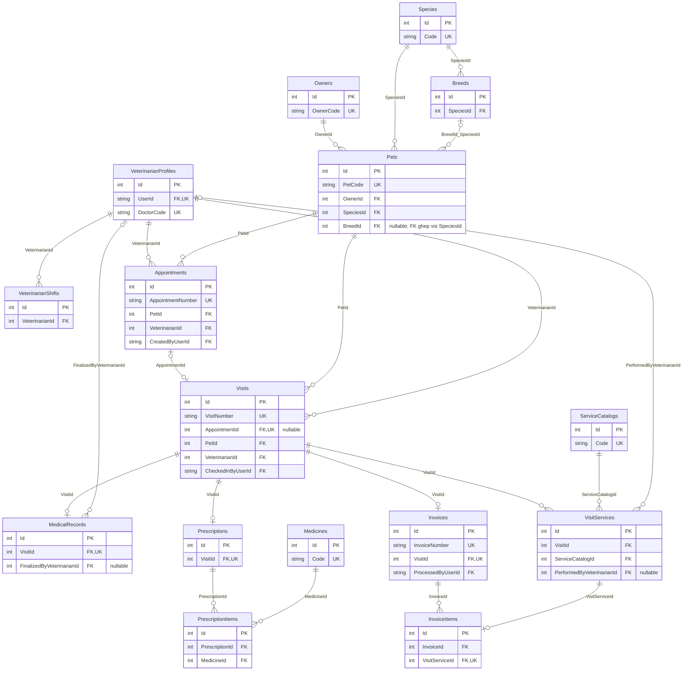

# Veterinary Hospital Management — ERD hiện tại

Cập nhật ngày 02/10/2026, đối chiếu `ApplicationDbContext`, cấu hình entity và `ApplicationDbContextModelSnapshot` trong repository. Model hiện có **26 bảng**, gồm 7 bảng ASP.NET Core Identity và 19 bảng bổ sung. Migration cuối trong repository là `20260926181724_AddInvoices`.

Sơ đồ mô tả schema được khai báo trong code. Database SQL Server trên từng máy chỉ có schema này sau khi áp dụng đầy đủ migrations; tài liệu không xác nhận tình trạng database đang chạy. Bản thiết kế nghiệp vụ ban đầu nằm ở [DatabaseDesign_v1.0.md](DatabaseDesign_v1.0.md).

## Cách đọc

- `||`: đúng một; `o|`: không có hoặc một; `o{`: không có hoặc nhiều.
- Các trường bên dưới chỉ liệt kê khóa và một số trường định danh để sơ đồ dễ đọc. `PK`, `FK`, `UK` lần lượt là khóa chính, khóa ngoại và khóa duy nhất.
- `nullable` là khóa ngoại tùy chọn. Các ràng buộc trạng thái có thể yêu cầu giá trị ở một bước nghiệp vụ cụ thể.
- Nhãn quan hệ là tên khóa ngoại ở bảng con. Tên bảng dùng đúng tên trong EF snapshot.

## Hồ sơ → lịch hẹn → khám → hóa đơn



- FK ghép của `Pets(BreedId, SpeciesId)` tham chiếu alternate key `Breeds(Id, SpeciesId)`, bảo vệ việc chọn giống thuộc đúng loài. `BreedId` có thể để trống.
- `Visits.AppointmentId` nullable cho walk-in và có unique index khi khác null: một lịch hẹn tạo tối đa một lượt khám.
- `Visits.PetId` có filtered unique index khi `Status` là `Waiting` hoặc `InProgress`; `VeterinarianId` có filtered unique index khi `Status` là `InProgress`. Quan hệ lịch sử vẫn là một-nhiều.
- `MedicalRecords.VisitId`, `Prescriptions.VisitId`, `Invoices.VisitId` và `InvoiceItems.VisitServiceId` có unique index. Đơn Draft và hóa đơn tổng 0 có thể chưa có dòng; điều kiện hoàn tất đơn được kiểm tra ở service.
- Hóa đơn giữ snapshot tên, số lượng và giá. `InvoiceItems` liên kết dòng dịch vụ của lượt khám; đơn thuốc không tự thêm tiền vào hóa đơn.

## Identity, phân quyền và người thực hiện

```mermaid
erDiagram
    AspNetUsers {
        string Id PK
    }
    AspNetRoles {
        string Id PK
    }
    AspNetUserRoles {
        string UserId PK,FK,UK
        string RoleId PK,FK
    }
    AspNetUserClaims {
        int Id PK
        string UserId FK
    }
    AspNetRoleClaims {
        int Id PK
        string RoleId FK
    }
    AspNetUserLogins {
        string LoginProvider PK
        string ProviderKey PK
        string UserId FK
    }
    AspNetUserTokens {
        string UserId PK,FK
        string LoginProvider PK
        string Name PK
    }
    Permissions {
        int Id PK
        string Code UK
    }
    RolePermissions {
        string RoleId PK,FK
        int PermissionId PK,FK
    }
    AuditLogs {
        bigint Id PK
        string UserId FK "nullable"
        string EntityName
        string EntityId
    }

    AspNetUsers ||--o| AspNetUserRoles : UserId
    AspNetRoles ||--o{ AspNetUserRoles : RoleId
    AspNetUsers ||--o{ AspNetUserClaims : UserId
    AspNetRoles ||--o{ AspNetRoleClaims : RoleId
    AspNetUsers ||--o{ AspNetUserLogins : UserId
    AspNetUsers ||--o{ AspNetUserTokens : UserId
    AspNetRoles ||--o{ RolePermissions : RoleId
    Permissions ||--o{ RolePermissions : PermissionId
    AspNetUsers o|--o{ AuditLogs : UserId
    AspNetUsers ||--o| VeterinarianProfiles : UserId
    AspNetUsers ||--o{ Appointments : CreatedByUserId
    AspNetUsers ||--o{ Visits : CheckedInByUserId
    AspNetUsers ||--o{ Invoices : ProcessedByUserId
```



- `AspNetUserRoles` có PK ghép `(UserId, RoleId)` và unique index riêng trên `UserId`: database cho phép tối đa một role mỗi user. Service quản trị tài khoản duy trì đúng một role; FK không bắt buộc mọi user phải có một bản ghi con.
- `RolePermissions` có PK ghép `(RoleId, PermissionId)`. Bốn role hệ thống là `Receptionist`, `Veterinarian`, `Manager`, `Admin`.
- `VeterinarianProfiles.UserId` có unique index. Tạo tài khoản với role `Veterinarian` qua service quản trị sẽ tạo hồ sơ bác sĩ nếu thiếu.
- `AuditLogs.UserId` nullable; `EntityName` và `EntityId` là thông tin tham chiếu ghi trong nhật ký, không phải khóa ngoại đến từng bảng nghiệp vụ.
- FK bổ sung/nghiệp vụ dùng `Restrict`. Các bảng phụ Identity dùng `Cascade` theo cấu hình mặc định Identity.

## Đối chiếu database trong SSMS

Kết nối SQL Server đang cấu hình trong `appsettings.Development.json`, mở database `VeterinaryHospitalManagementDb` và chạy truy vấn chỉ đọc:

```sql
SELECT [MigrationId]
FROM [dbo].[__EFMigrationsHistory]
ORDER BY [MigrationId];
```

Nếu migration cuối chưa là `20260926181724_AddInvoices`, chạy tại thư mục gốc repository sau khi kiểm tra connection string:

```powershell
dotnet tool restore
dotnet ef database update --project src/VeterinaryHospitalManagement.Web --startup-project src/VeterinaryHospitalManagement.Web
```

`__EFMigrationsHistory` là bảng hạ tầng EF, không thuộc 26 bảng entity trong ERD. Có thể xem sơ đồ này trực tiếp trong GitHub; Mermaid không tự tạo Database Diagram trong SSMS.
